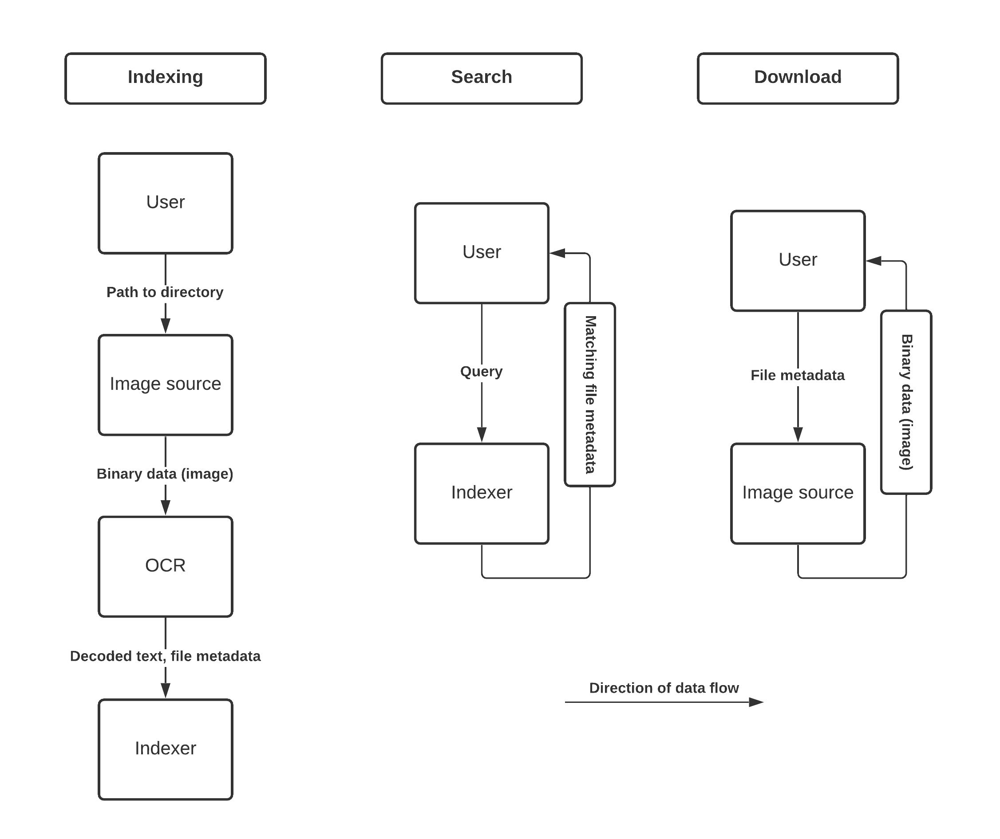

# dropbox-demo

An application accompanying [my talk about structuring functional applications in Scala](https://speakerdeck.com/kubukoz/connecting-the-dots-building-and-structuring-a-functional-application-in-scala).

## Run application

### Backend

Prerequisites: sbt, Elasticsearch running on `localhost:9200`, `tesseract` binary available on the `PATH` and runnable.

Elasticsearch is available in the attached `docker-compose` setup (the `.yml` file is generated from the [Dhall](https://dhall-lang.org/) file with the `make dcp` command, but the one in the repository should work). `tesseract` is available if you enter the attached `nix-shell`. The shell will also load environment variables from the `env.sh` file, if you have one (it's ignored in git).

Once you have these: `sbt run` - at time of writing the application starts on `0.0.0.0:4000`, this can be configured with the `HTTP_HOST`/`HTTP_PORT` environment variables.

### Frontend

Prerequisites: Node 14.x, npm (provided in a nix-shell in the `frontend` directory).

```shell
cd frontend
npm start
```

## Project goals

Search images from some storage by the text on them.

I have tens of thousands of images to search, and the OCR (optical character recognition) process takes ~0.5 seconds per image for relatively small images, so live decoding is a no-no.
Instead, we will allow the user to index a path from the store, and later search the database populated in that process.

The indexing will happen in the background, without the user having to wait for it to complete before getting a response.
We'll run the whole process in constant memory (except this is kind of up to Tesseract, I haven't investigated its memory usage on large images yet) - so both downloading the list of images to index, and their actual bytes, is done in a streaming fashion, thanks to fs2.

## Infrastructure

At the time of writing:

- OCR is performed by [Tesseract](https://github.com/tesseract-ocr/tesseract)
- Image source is Dropbox, we'll be using the [User API](https://www.dropbox.com/developers/documentation/http/documentation)
- Indexing and full text search are possible thanks to [Open Distro for Elasticsearch](https://opendistro.github.io).

Right now, this only runs on a local machine. Tesseract is provided via the [nix shell](https://nixos.org/), Open Distro runs in [docker](https://www.docker.com/). The application can be started using [bloop](https://scalacenter.github.io/bloop/).

## Tech stack

The backend is built in [Scala](https://scala-lang.org) (obviously - that was the point of the talk), using the following libraries:

- [Cats Effect 3](https://typelevel.org/cats-effect), for several things, such as monadic composition of asynchronous tasks (e.g. Elasticsearch client) and interop with other libraries from the ecosystem
- [fs2](https://fs2.io) - for streaming data, so that we can run the indexing process in constant memory, as long as the OCR implementation can do so
- [http4s](https://http4s.org/) - for the HTTP server, as well as a custom client for Dropbox
- [ciris](https://cir.is) - for compositionally loading configuration
- [circe](https://circe.github.io/circe) - for decoding/encoding JSON
- [log4cats](https://typelevel.org/log4cats/) - for logging
- [Elasticsearch high-level Java client](https://www.elastic.co/guide/en/elasticsearch/client/java-rest/current/java-rest-high.html) - for talking to Elasticsearch.
  Normally you could use something like [elastic4s](https://github.com/sksamuel/elastic4s/), but I only needed a subset of its functionality and wanted to show how this can be wrapped in `cats.effect.IO`
- [weaver](https://disneystreaming.github.io/weaver-test/) - for testing
- [chimney](https://scalalandio.github.io/chimney/) - for transforming similar datatypes

The frontend is built with [React](https://reactjs.org/) + [TypeScript](https://www.typescriptlang.org/). You'll need [Node 14.x and npm](https://nodejs.org/en/), both are provided with the attached nix shell in the `frontend` directory.

## Architecture

First of all, the data flow in processes that can be triggered by the user:



There are three main processes:

### Indexing

- Wait for the user to provide a directory to index (a path to the directory in Dropbox)
- Download metadata of all images within that directory (recursively)
- For each entry, get a stream of bytes of its content, push it to Tesseract
- Pass the metadata and the OCR decoding result to the indexer (Elasticsearch)

API:

```shell
# paths must start with /
http :4000/index path="/images"
```

```http
POST /index HTTP/1.1
Accept: application/json, */*;q=0.5
Accept-Encoding: gzip, deflate
Connection: keep-alive
Content-Length: 27
Content-Type: application/json
Host: localhost:4000
User-Agent: HTTPie/2.4.0

{
    "path": "/images"
}


HTTP/1.1 202 Accepted
Content-Length: 0
Date: Sun, 02 May 2021 17:57:19 GMT
```

### Search

- Ask the user for a query
- Pass the query to Elasticsearch with some level of fuzziness
- Pass results back to the user (metadata of matching files)

API:

```shell
http :4000/search\?query=test
```

```http
GET /search?query=test HTTP/1.1
Accept: */*
Accept-Encoding: gzip, deflate
Connection: keep-alive
Host: localhost:4000
User-Agent: HTTPie/2.4.0


HTTP/1.1 200 OK
Content-Type: application/json
Date: Sun, 02 May 2021 17:58:41 GMT
Transfer-Encoding: chunked

[
    {
        "content": "Some decoded text",
        "imageUrl": "http://127.0.0.1:4000/view/%2Fimages%2Ffile1.jpg",
        "thumbnailUrl": "http://127.0.0.1:4000/view/%2Fimages%2Ffile1.jpg"
    },
    {
        "content": "Another file with test text",
        "imageUrl": "http://127.0.0.1:4000/view/%2Fimages%2Ffile2.jpg",
        "thumbnailUrl": "http://127.0.0.1:4000/view/%2Fimages%2Ffile2.jpg"
    }
]
```

### Download

- Take a concrete file's path from the user (from file metadata)
- Return stream of bytes for that file

API:

```shell
http :4000/view/%2Fcamera%20uploads%2Fsnapy%2Fsnapchat-2233206587164039483.jpg
```

```http
GET /view/%2Fimages%2Ffile2.jpg HTTP/1.1
Accept: */*
Accept-Encoding: gzip, deflate
Connection: keep-alive
Host: localhost:4000
User-Agent: HTTPie/2.4.0


HTTP/1.1 200 OK
Content-Type: image/jpeg
Date: Sun, 02 May 2021 18:01:30 GMT
Transfer-Encoding: chunked


+-----------------------------------------+
| NOTE: binary data not shown in terminal |
+-----------------------------------------+
```

### Module graph


The blue boxes correspond to the processes outlined above (core logic), green boxes are high-level adapters for the underlying vendor-specific implementations - this is similar to the [hexagonal architecture](https://www.youtube.com/watch?v=sOaS83Ir8Ck) / Ports&Adapters patterns.

These correspond almost directly to the interfaces (Tagless Final algebras) in the project.
